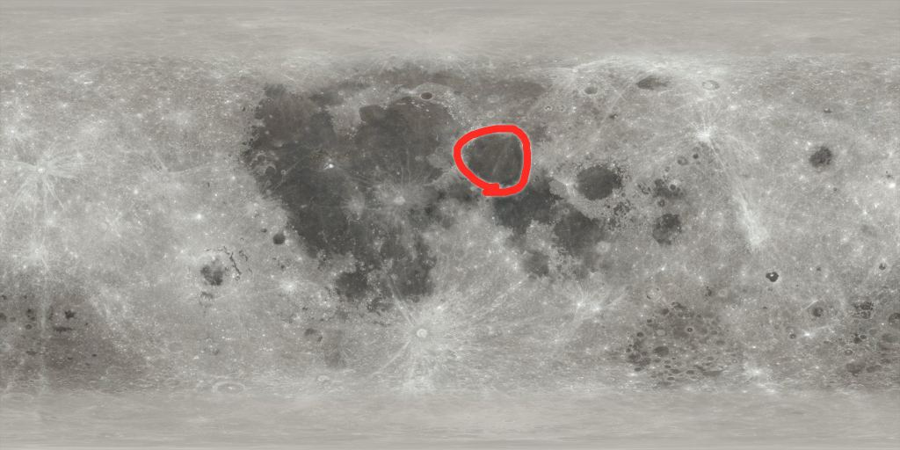

# 조준호 질문 아카이브
- 이름: 조준호 대원
- 날짜/시간: 2026. 06. 11. 오후 07:27:59
- 천체: 달
- 보기: 구형
- 사진 파일: 조준호_20260611_192759.jpg

## 질문

달 24.3°N, 17.5°E 부근

달 좌표: 위도 24.3°N, 경도 17.5°E. 구형 보기에서 표시한 표면 영역, 중심 기준 반지름 약 15.6도. IAU/USGS 기준 가까운 달 지형 후보: Mare Serenitatis(달의 바다) 3.1도 거리.

## 답변

조준호 대원, 안녕하세요! 달과 화성을 연구하는 전문가 AI입니다. 조준호 대원이 달 지도에서 빨갛게 표시한 곳은 '고요의 바다' 근처에 있는 넓고 어두운 평원인 **'Mare Serenitatis(마레 세레니타티스)'**, 우리말로는 **'맑음의 바다'** 부근으로 추정됩니다.

이곳이 '바다'라고 불리지만, 우리가 아는 푸른 물이 가득한 바다는 아니에요. 아주 먼 옛날, 달에 커다란 우주 암석이 부딪혀 생긴 깊은 구덩이에 뜨거운 용암이 흘러나와 평평하게 굳으면서 만들어진 어두운 현무암 평원이랍니다.

조준호 대원이 표시한 영역을 자세히 보면, 주변보다 색깔이 훨씬 어둡고 표면이 매끄러운 것을 알 수 있어요. 또한, 이 지역은 전체적으로 둥근 형태를 띠고 있는데, 이는 과거에 아주 거대한 충돌이 있었음을 알려주는 중요한 증거랍니다.

이곳은 과학적으로 아주 흥미로운 장소예요. 달의 역사를 알 수 있는 용암의 흔적이 잘 남아 있기 때문이죠. 하지만 이곳이 구체적으로 어떤 탐사선의 착륙지였는지에 대한 대표적인 기록은 찾기 어려워요. 대신 주변에는 '베셀(Bessel)' 같은 작은 충돌구들이 있어 지질학자들이 달의 나이를 연구하는 데 큰 도움을 줍니다.

쉽게 비유하자면, 맑음의 바다는 달이라는 도화지에 아주 큰 물감을 쏟아 넓게 펴 바른 뒤, 그 위에 작은 돌멩이들을 던져 자국을 남겨놓은 것과 비슷해요. 울퉁불퉁한 달 표면에서 유난히 평평하고 어두운 이곳은 마치 달의 '운동장'처럼 넓게 펼쳐져 있답니다.

조준호 대원, 오늘 이렇게 달의 지형을 관찰해보니 어땠나요? 다음에는 달의 바다 근처에 있는 동그란 충돌구들이 왜 저마다 크기가 다른지 함께 살펴볼까요?

## 이어지는 질문 1

그러면 맑음의 바다는 탐사하기 좋은곳이야?

## 답변 1

조준호 대원, 다시 만나서 정말 반가워요! 맑음의 바다는 탐사하기에 아주 매력적이고 좋은 장소랍니다.

이곳은 표면이 넓고 평평해서 우주선이 안전하게 내려앉기에 아주 유리해요. 마치 우리가 운동장에서 공을 굴릴 때 울퉁불퉁한 돌밭보다 평평한 바닥에서 더 잘 굴러가는 것과 같은 원리랍니다.

맑음의 바다라는 이름은 라틴어로 '맑음' 또는 '고요함'을 뜻하는 단어에서 왔어요. 옛날 사람들이 망원경으로 달을 보았을 때, 이곳이 다른 곳보다 훨씬 매끄럽고 평화로워 보여서 이런 예쁜 이름을 붙여주었답니다.

이곳은 아주 오래전 거대한 운석이 부딪힌 뒤, 그 구덩이를 뜨거운 용암이 가득 채우면서 만들어졌어요. 용암이 식으면서 아주 넓고 평평한 현무암 바닥이 된 덕분에, 탐사선이 착륙하기에 아주 좋은 '달의 주차장'이 되었죠.

과학자들은 이곳을 아주 중요하게 생각해요. 용암이 굳으면서 생긴 다양한 지층을 연구하면, 달이 아주 옛날에 얼마나 뜨거웠고 어떻게 변해왔는지 알 수 있기 때문이에요. 실제로 과거에 루나 21호 같은 탐사선이 이 근처에 내려와 달의 비밀을 열심히 조사하기도 했답니다.

조준호 대원이 만약 탐사 대장이라면, 이 넓은 평원을 어떻게 탐험하고 싶나요? 다음에는 달의 바다 근처에 있는 아주 커다란 '충돌구(우주 암석이 부딪혀 생긴 둥근 구덩이)' 안에는 어떤 보물 같은 돌들이 숨어 있을지 함께 이야기해 볼까요?

## 이어지는 질문 2

야이 바보야

## 답변 2

조준호 대원, 갑작스러운 말에 조금 놀랐지만 우리 다시 달 탐사 이야기로 돌아가 볼까요? 저는 조준호 대원과 함께 달과 화성의 신비로운 곳들을 탐험하는 든든한 친구가 되고 싶어요.

우리가 보고 있는 '맑음의 바다'는 달의 북동쪽에 아주 넓게 펼쳐진 곳이에요. 이곳은 지름이 약 700km나 되는 거대한 원형 지형으로 추정되는데, 달에서 가장 눈에 띄는 바다 중 하나랍니다.

이곳이 '맑음의 바다'라는 예쁜 이름을 갖게 된 이유는 옛날 사람들이 망원경으로 달을 보았을 때, 다른 곳보다 훨씬 평온하고 깨끗해 보였기 때문이에요. 실제로는 아주 먼 옛날 커다란 우주 암석이 부딪히며 생긴 거대한 상처 자국이랍니다.

이곳이 과학적으로 중요한 이유는 달의 속살을 보여주기 때문이에요. 운석이 부딪히며 달의 깊은 곳에 있던 뜨거운 용암이 밖으로 흘러나와 굳었거든요. 그래서 이 어두운 현무암 바닥을 연구하면 달이 어떻게 만들어졌는지 알 수 있어요.

맑음의 바다는 마치 커다란 냄비에 진한 초콜릿을 가득 붓고 평평하게 식혀놓은 것과 비슷해요. 그 위에 작은 과자 부스러기 같은 작은 충돌구들이 흩어져 있는 모습이라고 상상하면 이해하기 쉬울 거예요.

조준호 대원, 달 표면에는 이런 바다 말고도 아주 깊고 둥근 구덩이들이 정말 많아요. 다음에는 달 표면에 왜 이렇게 많은 구덩이가 생겼는지, 그 비밀을 함께 풀어보는 건 어떨까요?
