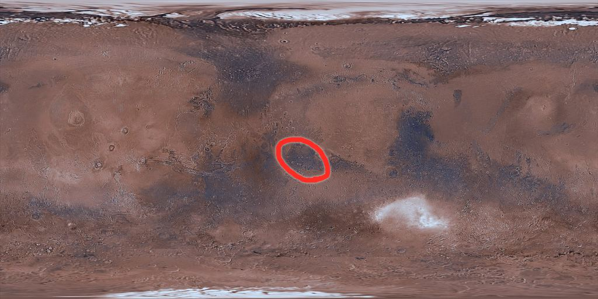

# 조준호 질문 아카이브
- 이름: 조준호 대원
- 날짜/시간: 2026. 06. 11. 오후 07:42:37
- 천체: 화성
- 보기: 구형
- 사진 파일: 조준호_20260611_194237.jpg

## 질문

화성 8.1°S, 4.1°E 부근

화성 좌표: 위도 8.1°S, 경도 4.1°E. 구형 보기에서 표시한 표면 영역, 중심 기준 반지름 약 19.1도. MOLA/IAU 기준 가까운 지형 후보: Meridiani Planum(평원) 10.8도 거리, Endeavour(충돌구) 11.0도 거리, Victoria(충돌구) 11.3도 거리.

## 답변

조준호 대원, 안녕! 화성 탐사를 위해 지도를 꼼꼼히 살펴보고 있군요. 대원이 빨간색으로 표시한 영역은 화성의 적도 근처에 있는 아주 넓은 지역이에요.

이곳은 특별한 이름이 붙은 하나의 장소라기보다, 화성의 넓은 평원과 고지대가 만나는 곳으로 보여요. 표시한 좌표가 특정 지형의 중심과는 거리가 조금 있어서, 정확한 지명을 하나로 단정하기는 어렵답니다. 대신 이 주변은 화성에서 아주 유명한 '메리디아니 평원(Meridiani Planum)'과 가까운 곳이에요.

이 지역을 관찰할 때 가장 눈에 띄는 근거는 두 가지예요. 첫 번째는 주변보다 색이 조금 더 어둡게 보인다는 점이고, 두 번째는 전체적으로 평평하고 넓게 펼쳐진 지형이라는 점이에요. 마치 넓은 운동장처럼 평평한 땅이 끝없이 이어져 있는 모습이죠.

이런 지형은 아주 오랜 시간 동안 화성의 먼지가 쌓이고, 바람에 깎이면서 만들어졌어요. 때로는 커다란 우주 암석이 부딪혀 생긴 충돌구(우주 암석이 부딪혀 생긴 둥근 구덩이)들이 세월이 흐르며 흙으로 메워지기도 해요. 그래서 지금처럼 부드러운 평원처럼 보이게 된 것이랍니다.

과학자들은 이런 곳을 아주 중요하게 생각해요. 왜냐하면, 과거에 물이 흘렀을 것으로 추정되는 흔적들이 이 주변 평원에서 자주 발견되기 때문이에요. 만약 과거에 물이 있었다면, 그곳에 생명체가 살 수 있었을지 연구하는 것이 우리 탐사의 큰 목표랍니다.

이곳을 이해하기 쉽게 비유하자면, 아주 커다란 사막에 모래가 평평하게 깔린 모습이라고 생각하면 돼요. 바람이 모래를 골고루 펴주어서 울퉁불퉁한 곳 없이 매끈한 운동장이 된 것과 비슷하죠.

조준호 대원, 그럼 다음에는 이 평원 근처에 있는 작은 구덩이들이 왜 생겼는지 더 자세히 알아볼까요? 혹시 화성에 있는 커다란 화산들은 어디에 있는지 궁금하지 않나요?
