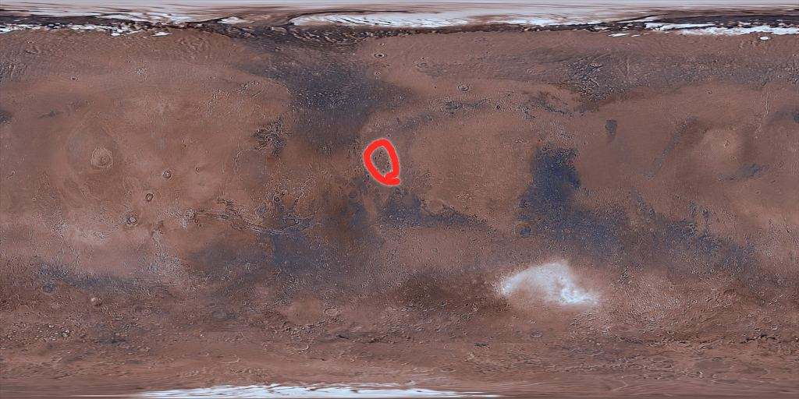

# 조준호 질문 아카이브
- 이름: 조준호 대원
- 날짜/시간: 2026. 06. 11. 오후 07:43:37
- 천체: 화성
- 보기: 구형
- 사진 파일: 조준호_20260611_194337.jpg

## 질문

화성 16.5°N, 7.3°W 부근

화성 좌표: 위도 16.5°N, 경도 7.3°W. 구형 보기에서 표시한 표면 영역, 중심 기준 반지름 약 10.2도. MOLA/IAU 기준 가까운 지형 후보: Arabia Terra(오래된 고지대) 13.2도 거리.

## 답변

조준호 대원, 안녕하세요! 달과 화성 탐사 전문가 AI입니다. 대원이 화성 지도에서 표시한 빨간색 영역을 함께 살펴볼까요?

이 지역은 아주 넓고 오래된 고지대인 '아라비아 테라(Arabia Terra)' 부근으로 추정됩니다. '아라비아 테라'라는 이름은 아주 옛날 천문학자들이 망원경으로 화성을 관찰할 때, 밝고 어두운 무늬를 보고 지어준 고전적인 이름이에요.

이곳을 살펴보면 다른 곳보다 지형이 울퉁불퉁하고 색깔이 조금 더 밝게 보입니다. 아주 오랜 시간 동안 수많은 우주 암석이 부딪혀 생긴 충돌구(우주 암석이 부딪혀 생긴 둥근 구덩이)들이 겹쳐 있고, 그 위에 먼지가 두껍게 쌓여 있기 때문이에요.

이런 지형은 화성의 아주 초기 시절에 만들어졌습니다. 행성이 처음 태어난 뒤 수십억 년 동안 수많은 운석이 떨어지면서 표면이 깎이고 다듬어지며 지금처럼 복잡한 모습이 되었답니다.

과학자들은 이곳이 왜 중요한지 아주 궁금해하고 있어요. 이 넓은 땅 아래에는 화성의 아주 먼 과거에 대한 비밀이 숨겨져 있을지도 모르기 때문입니다. 하지만 이곳이 구체적으로 어떤 탐사선의 착륙지였는지에 대한 대표적인 기록은 찾기 어렵습니다.

이곳을 마치 아주 오래된 '화성의 역사책'이라고 생각하면 쉬워요. 책장이 낡고 찢어진 것처럼 화성의 표면도 시간이 지나면서 낡았지만, 그 속에 담긴 내용은 화성이 어떻게 변해왔는지 알려주는 소중한 정보가 되니까요.

조준호 대원, 화성에는 이렇게 넓은 고지대 말고도 깊은 계곡이나 커다란 화산도 아주 많답니다. 다음에는 화성에서 가장 높은 산인 '올림푸스 산'이 어디에 있는지 한번 찾아보는 건 어떨까요?
